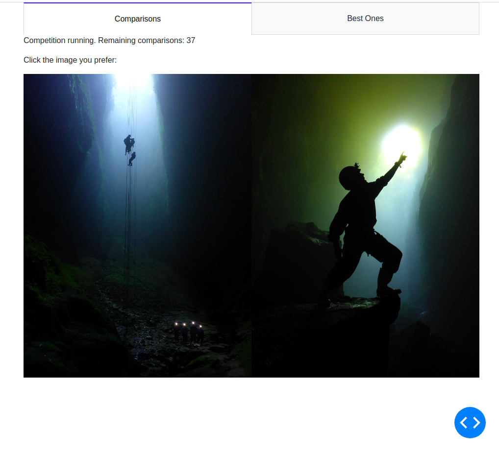

# Image Sorting

Project to quickly partiton the best, say, 20 images, from a larger album.

Created because I have albums of hundreds of images, and would like an easy way to pull out a few of the best ones.

The project is mainly built on the idea of using a series of manual pairwise image comparisons to determine overall which photos are the best. The thinking is that a single pairwise image comparison is mentally simple, compared to attempting to sort out a whole album at once. Hence with this approach the album is sorted through a series of mentally simple operations, rather than a single mentally taxing one.

This approach is implemented in this repo as a [plotly dash app](pic_pick.py).

Image comparisons are performed by presenting both images to the user, and prompting them to select the best one.

__Screenshot of image comparison app in action:__

# First Go: Single Elimination Tournament

As a first try, I used the logic of [single elimination tournaments](https://en.wikipedia.org/wiki/Single-elimination_tournament) to choose which photos to compare, and how to interpret the comparison results to determine overall which photos are best.

__Example single elimination tournament (source wikipedia)__

In this scheme, each image comparison represents a 'match' between the two presented images, and matches continue until all but the top n competitors (images) have been eliminated. 

### Run it live:
1) clone this repo
2) ./pic_pick.py -h

## Next Steps
Some avenues to think about, going beyond the single-elimination approach:
* Which images should be presented to the user for comparison?  
   We don't want to want to waste time comparing images that won't make it into the top partition, really we want to focus on comparisons which are likely to move an image over the partition boundary.  
   At the same time, we don't want to focus all of our comparisons on a small subset of the images (want a fair distribution of comparisons over all images)
* How to handle conflicting results?  
   Consider the case where the user specifies that image A is better than B, B is better than C, and C is better than A. This cycle represents a conflict, but is a likely outcome given enough random comparisons. How can we return a final image ranking that most satifies the image comparison results, even in the case of conflicts?
* How to handle similar images?   
   How to handle the case when the top 10 images are all variations on the same shot - we want the final album to have the best images, but also a diversity of images.
